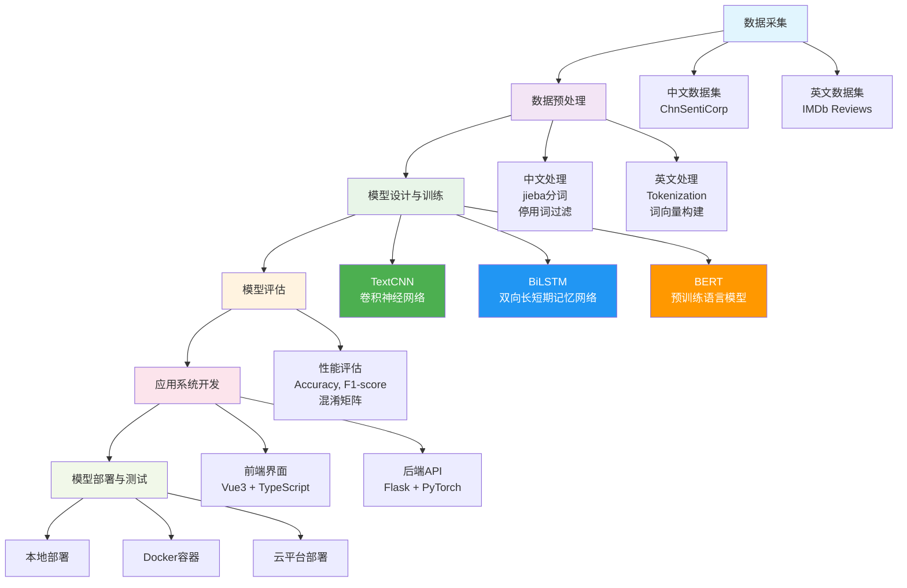

# 基于深度学习的文本情感分析研究与应用

---

## 一、项目背景与研究意义

在社交媒体、新闻评论、电商平台等场景中，用户生成的海量文本中蕴含着丰富的情绪信息。如何准确识别文本中的情感倾向，成为自然语言处理（NLP）领域的核心任务之一。传统基于规则或浅层机器学习的情感分析方法已难以应对语言的多样性与复杂表达，而深度学习技术凭借其强大的特征提取能力，逐步成为情感分析的主流方法。

本课题旨在通过研究主流深度学习模型（如TextCNN、BiLSTM、BERT）在情感分析中的表现，结合中文与英文的真实评论数据，构建一套可应用的情感分析系统，并探索其在多语言环境下的实际效果。

---

## 二、设计目标

1. 基于公开数据集训练深度学习情感分类模型。
2. 比较不同模型（TextCNN、BiLSTM、BERT）在情感分析任务中的效果差异。
3. 构建一个简洁易用的情感分析应用系统，支持用户输入文本并返回情感结果。
4. 为未来在评论分析、舆情监控等实际场景中应用提供基础技术方案。

---

## 三、数据集选型与获取方式

### 中文数据集：ChnSentiCorp

* **数据量**：约12,000条中文评论（酒店、书籍、餐饮）
* **情感标签**：正面（1）、负面（0）
* **多数据源支持**：
  * 🥇 Hugging Face (主): [seamew/ChnSentiCorp](https://huggingface.co/datasets/seamew/ChnSentiCorp)
  * 🥈 Kaggle API (备用): [kaggleyxz/chnsenticorp](https://www.kaggle.com/datasets/kaggleyxz/chnsenticorp)
  * 🥉 GitHub (备用): 开源中文情感数据集

### 英文数据集：IMDb Movie Reviews

* **数据量**：共50,000条英文电影评论（正负各半）
* **情感标签**：正面（1）、负面（0）
* **多数据源支持**：
  * 🥇 Hugging Face (主): [imdb](https://huggingface.co/datasets/imdb)
  * 🥈 Kaggle API (备用): lakshmi25npathi/imdb-dataset-of-50k-movie-reviews

> **智能下载策略**：系统会自动从Hugging Face下载，失败时自动切换到Kaggle备用数据源，确保数据获取的稳定性。详见 [KAGGLE_SETUP.md](KAGGLE_SETUP.md) 配置说明。

---

## 四、技术路线

整体流程如下：



### 1. 数据预处理

* 中文：jieba 分词、停用词过滤、统一编码
* 英文：Tokenization（NLTK 或 Hugging Face Tokenizer）
* 构建词向量：使用预训练 Word2Vec、GloVe，或通过 Transformer 自带嵌入

### 2. 模型设计

| 模型名称    | 说明                           |
| ------- | ---------------------------- |
| TextCNN | 卷积神经网络适合短文本特征提取              |
| BiLSTM  | 捕捉上下文语义序列关系                  |
| BERT    | 基于 Transformer 的预训练语言模型，支持微调 |

* 框架：PyTorch 或 TensorFlow 2.x
* 损失函数：交叉熵
* 优化器：Adam
* 训练策略：EarlyStopping、Validation Split、混合精度（AMP）

### 3. 性能评估

* 评估指标：Accuracy、Precision、Recall、F1-score
* 可视化：绘制混淆矩阵、训练曲线、loss/acc曲线

### 4. 应用开发

* 前端：基于 Streamlit 或 Vue 构建情感分析界面
* 后端：Flask 或 FastAPI 提供模型推理 API
* 部署：本地部署 / Docker 容器 / Hugging Face Space / Streamlit Cloud

---

## 五、系统结构设计

### 🏗️ 系统架构分层

| 层级 | 组件 | 技术栈 | 主要功能 |
|------|------|--------|----------|
| **用户层** | Web前端界面 | Vue 3 + TypeScript + Element Plus | 用户交互、数据展示、操作界面 |
| **API层** | RESTful API服务 | Flask + CORS | 路由处理、请求响应、接口管理 |
| **业务逻辑层** | 核心业务模块 | Python + PyTorch | 情感分析、模型训练、数据处理 |
| **模型层** | 深度学习模型 | TextCNN/BiLSTM/BERT | 特征提取、情感分类、模型推理 |
| **数据层** | 数据存储管理 | 本地文件系统 | 数据集存储、模型文件管理 |
| **工具层** | 辅助工具模块 | jieba/NLTK/transformers | 文本预处理、配置管理、工具函数 |

### 📋 核心模块详细说明

#### 🎨 前端模块
| 页面/组件 | 功能描述 | 主要特性 |
|-----------|----------|----------|
| 首页 (HomeView) | 项目介绍和导航 | 响应式布局、项目概览 |
| 数据集管理 (DatasetView) | 数据下载和管理 | 进度显示、多数据源支持 |
| 模型训练 (TrainingView) | 模型训练控制 | 实时监控、参数配置 |
| 模型管理 (ModelsView) | 模型加载和切换 | 模型列表、状态管理 |
| 情感分析 (AnalyzeView) | 文本分析界面 | 单文本/批量分析、结果可视化 |

#### ⚙️ 后端模块
| 模块 | 文件路径 | 主要功能 |
|------|----------|----------|
| API服务 | `src/api/app.py` | 主要API路由和请求处理 |
| 训练API | `src/api/training_api.py` | 模型训练相关接口 |
| 情感分析器 | `src/services/sentiment_analyzer.py` | 核心分析逻辑 |
| 训练管理器 | `src/training/trainer_manager.py` | 训练流程控制 |
| 数据加载器 | `src/scripts/dataset_loader.py` | 数据集下载和预处理 |
| 文本处理器 | `src/utils/text_processor.py` | 文本预处理工具 |
| 配置管理 | `src/utils/config.py` | 系统配置和路径管理 |

#### 🤖 模型架构
| 模型类型 | 文件路径 | 适用场景 | 特点 |
|----------|----------|----------|------|
| TextCNN | `src/architectures/textcnn.py` | 短文本分类 | 快速训练、效果稳定 |
| BiLSTM | `src/architectures/bilstm.py` | 序列文本分析 | 捕获上下文、语义理解强 |
| BERT | `src/architectures/bert_model.py` | 复杂语义理解 | 预训练优势、准确率高 |

### 🔄 数据流向

```
用户输入 → 前端界面 → API接口 → 业务逻辑 → 模型推理 → 结果返回 → 前端展示
```

### 🛠️ 技术选型理由

| 技术 | 选择理由 |
|------|----------|
| **Vue 3** | 现代化前端框架，组合式API，TypeScript支持好 |
| **Element Plus** | 成熟的UI组件库，开发效率高，界面美观 |
| **Flask** | 轻量级Web框架，易于扩展，适合API开发 |
| **PyTorch** | 灵活的深度学习框架，研究友好，社区活跃 |
| **Hugging Face** | 丰富的预训练模型，标准化的数据集接口 |

---

## 六、开发环境与工具

| 类别    | 工具/平台                          |
| ----- | ------------------------------ |
| 编程语言  | Python 3.8+                    |
| 开发框架  | PyTorch / TensorFlow           |
| 文本处理  | jieba、NLTK、transformers        |
| 可视化   | Matplotlib、Seaborn、Streamlit   |
| Web后端 | Flask / FastAPI                |
| 数据集管理 | Hugging Face Datasets / Kaggle |
| 部署方式  | 本地运行 / 云平台（可选 Docker）          |

---

## 七、项目进度安排

| 时间阶段  | 任务内容                     |
| ----- | ------------------------ |
| 第1-2周 | 文献调研、确定技术路线、下载数据集        |
| 第3-4周 | 数据预处理、训练TextCNN与BiLSTM模型 |
| 第5-6周 | 微调BERT模型，进行模型对比分析        |
| 第7周   | 搭建前后端应用系统，部署情感分析接口       |
| 第8-9周 | 系统测试与完善、撰写论文初稿           |
| 第10周  | 准备答辩展示、整理代码与实验报告         |

---

## 八、智能训练特性

🚀 **智能数据管理**：
- 自动检测已下载的数据集，避免重复下载
- 多数据源备用机制，确保数据获取稳定性
- 训练时自动加载本地数据，提升效率

🎯 **用户友好界面**：
- 实时显示数据集下载状态
- 训练进度可视化跟踪
- 智能参数推荐系统

---

## 九、预期成果

1. 训练出准确率达85%以上的中文与英文情感分类模型。
2. 完整的情感分析应用原型系统，可支持实际文本分析。
3. 毕业论文1篇，涵盖模型设计、数据处理、实验结果与系统实现。
4. 项目代码开源，便于后续扩展与复用。

---

## 十、许可证

本项目采用 [MIT 许可证](LICENSE) 开源。

### 许可证摘要

✅ **允许**：
- 商业使用
- 分发
- 修改
- 私人使用

❗ **要求**：
- 包含许可证和版权声明

🚫 **限制**：
- 不提供责任保证
- 不提供质量保证

### 引用说明

如果本项目对您的研究或开发有帮助，欢迎引用：

```
Deep Learning Text Sentiment Analysis Project
GitHub: https://github.com/Snake-Konginchrist/deep-learning-text-sentiment-analysis
License: MIT
```

---

## 十一、快速启动

### 📋 环境要求

- Python 3.8+
- Node.js 16+
- npm 或 yarn

### 🚀 后端启动

1. **克隆项目**
   ```bash
   git clone https://gitee.com/Snake-Konginchrist/deep-learning-text-sentiment-analysis.git
   cd deep-learning-text-sentiment-analysis
   ```

2. **创建并激活虚拟环境**
   ```bash
   # 创建虚拟环境
   python -m venv venv
   
   # 激活虚拟环境
   # Windows:
   venv\Scripts\activate
   # macOS/Linux:
   source venv/bin/activate
   ```

3. **安装Python依赖**
   ```bash
   pip install -r requirements.txt
   ```

4. **配置Kaggle API（可选）**
   ```bash
   # 复制环境变量模板
   cp .env.example .env
   # 编辑.env文件，添加Kaggle API凭据（参考KAGGLE_SETUP.md）
   ```

5. **启动后端服务**
   ```bash
   python run_server.py
   ```
   
   后端服务将在 `http://localhost:5000` 启动

### 🎨 前端启动

1. **进入前端目录**
   ```bash
   cd webui
   ```

2. **安装依赖**
   ```bash
   npm install
   # 或使用 yarn
   yarn install
   ```

3. **启动开发服务器**
   ```bash
   npm run dev
   # 或使用 yarn
   yarn dev
   ```
   
   前端服务将在 `http://localhost:5173` 启动

### 📱 访问应用

打开浏览器访问 `http://localhost:5173`，即可使用情感分析系统：

- 🏠 **首页**: 项目介绍和快速开始
- 📊 **数据集管理**: 下载和管理训练数据
- 🎯 **模型训练**: 训练深度学习模型
- 📦 **模型管理**: 加载和切换已训练模型
- 🔍 **情感分析**: 进行文本情感分析

### ⚡ 快速体验

1. **下载数据集**: 访问数据集页面，选择语言并下载数据
2. **训练模型**: 在训练页面选择模型类型开始训练
3. **加载模型**: 在模型管理页面加载已训练的模型
4. **开始分析**: 在分析页面输入文本进行情感分析

### 🔧 常见问题

**Q: 后端启动失败？**
A: 确保已安装所有Python依赖，检查端口5000是否被占用

**Q: 虚拟环境激活失败？**
A: 确保Python已正确安装，Windows用户可能需要使用`python -m venv venv`，macOS/Linux用户确保有权限创建目录

**Q: 依赖安装失败？**
A: 确保虚拟环境已激活，可以尝试升级pip：`pip install --upgrade pip`，然后重新安装依赖

**Q: 前端无法连接后端？**
A: 确认后端服务正在运行，检查`webui/src/services/api.ts`中的API地址

**Q: 模型训练失败？**
A: 确保已下载对应的数据集，检查GPU/CPU环境配置

**Q: 无法下载数据集？**
A: 参考`KAGGLE_SETUP.md`配置Kaggle API，或检查网络连接

**Q: 如何退出虚拟环境？**
A: 在激活的虚拟环境中输入`deactivate`命令即可退出

---

## 十二、贡献指南

欢迎提交 Issues 和 Pull Requests 来改进此项目！

### 如何贡献

1. Fork 本仓库
2. 创建您的特性分支 (`git checkout -b feature/AmazingFeature`)
3. 提交您的更改 (`git commit -m 'Add some AmazingFeature'`)
4. 推送到分支 (`git push origin feature/AmazingFeature`)
5. 打开一个 Pull Request

### 开发规范

- 遵循项目现有的代码风格
- 为新功能添加适当的测试
- 更新相关文档
- 确保所有测试通过

---

**感谢您对本项目的关注和支持！** 🚀